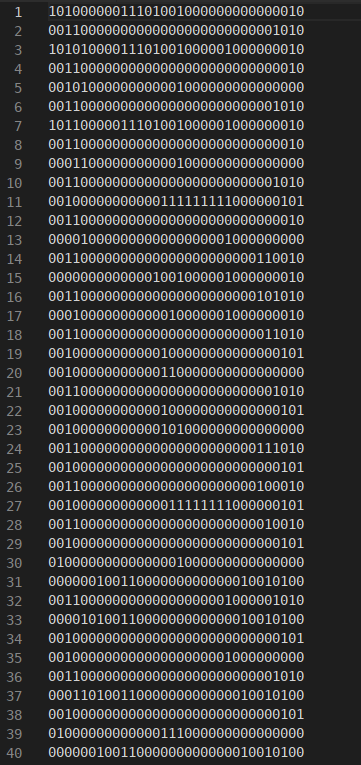
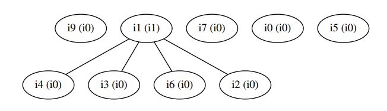

University of Toronto

ECE532 2018-2019

Final Report

<table>
  <tr>
    <td>Group #</td>
    <td>2</td>
    <td>Date</td>
    <td>2019.04.08</td>
  </tr>
</table>

<table>
  <tr>
    <td>Project Name</td>
    <td>Fog GPU Computing</td>
  </tr>
  <tr>
    <td>Team Member</td>
    <td>Lichen Liu
Lin Sun
Feiyu Ren</td>
  </tr>
  <tr>
    <td>TA</td>
    <td>Mohammad Tabrizi</td>
  </tr>
</table>

**1.0 Overview**

**1.1 Introduction and Motivation**

Cloud Computing has been arising these days, it separates the computing resources from clients’ actual business logic such that the client only needs to focus on implementing their business ideas without worrying too much about IT side of things. However, cloud computing is more common to be a service from large companies, where the cloud servers are located remotely in the data center. A gap exists between such  kind of cloud computing where throughput is deemed more important than latency, and the kind of computing that the team has foreseen, where latency also matters.

Image a scenario looks like this. Peter and Ray live together in an apartment, and they are both relying on GPUs to do things: Peter wants to train his machine learning models, whereas Ray is doing a lot of video processing. High-End video cards are expensive nowadays so that Peter and Ray would like to share a single GPU card, but they would not want to plug and unplug every time they use it.

The team is proposing another kind of cloud computing solution, Fog(Cloud on the ground) GPU Computing, that would perfectly fulfil their needs, that a single GPU is shared with multiple clients using local network connections.

**1.2 Project Description**

The project consists of two subsystems: a GPU computation server, and a client application, which is connected via ethernet. Due to the time limitation, the client-side application will only use the GPU computation server to compute graphics-related tasks, as opposed to other tasks such as machine learning training tasks.

The GPU computation server is in charge of cloud computing and is built entirely on an FPGA chip. Most of the area on the chip is for the GPU implementation, that supports a simple instruction set architecture. The subsystem has a Mircoblaze processor, used mainly for network connection and GPU scheduling purposes. It also has a WiFi module, for peer-to-peer connection with the client.

The client application side consists of a Mircoblaze processor, an Ethernet module for peer-to-peer connection with the GPU computation server, and a VGA module to display the output produced by the GPU, e.g. the picture rendered by the GPU.

The core of the project is the demonstration of a shared GPU solution, thus a general purpose GPU is essential. The project comes with the implementation of a fully customized and hand-crafted GPU with its own instruction set architecture (ISA). The project also includes an entire compiler toolchain support to ease the development using the new ISA.

**1.3 Functional Requirements and Features**

1. GPU server and client must be on different physical machines.

2. GPU server and client must be using a network to connect.

3. GPU must be general-purpose processing unit.

4. The client must be able to display the result of the computation.

5. Compiler toolchain support for GPU.

**1.4 Acceptance Criteria**

1. GPU and client are implemented on two different boards

2. GPU communicates with the host through networks

3. GPU should have its own instruction set.

4. The client can use VGA to display the rendered picture to the monitor.

5. Development on the new GPU should be easy, ie. developing using a high-level language.

**1.5 Proposed System Flow**

Figure 1. The proposed system flow chart.

 

As the project includes the design of a fully customized and hand-crafted GPU with customized instruction set architecture (ISA) from scratch, with usability in mind, the project is also targeting to provide full compiler-toolchain support. A proposed system flow shown in figure 1 demonstrates the procedure and steps of using the design. The compiler takes in a GLSL-like (or C-like) language and compiles into the machine code that is encoded using the customized ISA. The compiler supports macros that are supported by C. The compiler is also able to allocate the limited amount of general purpose registers in GPU efficiently, which allows the user to write much more complicated and complex programs to be run on the GPU. Next, the compiled binary code is sent to the server board. Microblaze running on the server board will then launch the kernels onto the GPU, which in turn, runs the user program. The program running on the GPU is designed to produce a well-rendered image, and this image is transferred to the client for display via ethernet connection.

**1.6 GPU**

The general architecture of the customized GPU is inspired by CUDA, which employs a Single Instruction Multiple Data (SIMD) execution schemes. SIMD execution scheme allows a single kernel to be launched multiple times on the GPU. The performance boost mainly comes from two levels of parallelization: each instruction is dispatched on 16 words wide lane, and multiple warps are pooled to be dispatched when their dependencies are satisfied, therefore hiding latency should a warp initiates a long operation. Each thread identifies itself via special instructions blockIdx, blockDim, threadIdx (analogous to CUDA blockIdx.x, blockDim.x, threadIdx.x). and calculates is corresponding coordinate/address.

Figure 2. A high-level modular overview of the customized GPU.

**1.7 System Block Diagram**

Figure 3. A high-level system-level overview of the entire system. The first system (upper one) is the server board, responsible for GPU computation. The second system (lower one) is the client board, responsible for display the result via VGA. These two systems are connected via TCP.

**1.8 Project Complexity**

<table>
  <tr>
    <td>Feature/Operation/Ip core</td>
    <td>Points</td>
  </tr>
  <tr>
    <td>Microblaze</td>
    <td>1</td>
  </tr>
  <tr>
    <td>Custom IP - GPU core</td>
    <td>TBD, 1+</td>
  </tr>
  <tr>
    <td>DDR</td>
    <td>1</td>
  </tr>
  <tr>
    <td>VGA</td>
    <td>1</td>
  </tr>
  <tr>
    <td>Network</td>
    <td>1</td>
  </tr>
  <tr>
    <td>Compiler for converting C-like language to the customized GPU assembly</td>
    <td>TBD</td>
  </tr>
</table>

**2.0 Outcome**

The team has achieved the majority of the initially proposed project plan. Client and server boards are able to communicate with each other via TCP connection. The client board is also able to display an image using VGA. The GPU compiler toolchain is fully completed and working and is regression tested. The GPU itself also functions correctly under rigorous testing in the simulator (Verilator). However, the main challenge of porting GPU onto the Xilinx FPGA board is not yet accomplished. This will be discussed in detail in later sections.

The following figure shows a modified system flow.

 

Figure 4. The modified system flow diagram, where the red text colour indicates the changes being made.

**2.1 Functional Requirements, Features, and Acceptance Criteria**

<table>
  <tr>
    <td>ID</td>
    <td>Functional Requirements and Features</td>
    <td>Acceptance Criteria</td>
    <td>Result</td>
  </tr>
  <tr>
    <td>1</td>
    <td>GPU server and client must be on different physical machines.</td>
    <td>GPU and client are implemented on two different boards</td>
    <td>Achieved. See section 2.2.</td>
  </tr>
  <tr>
    <td>2</td>
    <td>GPU server and client must be using a network to connect.</td>
    <td>GPU communicates with the host through networks</td>
    <td>Achieved. See section 2.2.</td>
  </tr>
  <tr>
    <td>3</td>
    <td>GPU must be general-purpose processing unit.</td>
    <td>GPU should have its own instruction set.</td>
    <td>Achieved. See section 2.4.</td>
  </tr>
  <tr>
    <td>4</td>
    <td>The client must be able to display the result of the computation.</td>
    <td>The client can use VGA to display the rendered picture to the monitor.</td>
    <td>Achieved. See section 2.3.</td>
  </tr>
  <tr>
    <td>5</td>
    <td>Compiler toolchain support for GPU.</td>
    <td>Development on the new GPU should be easy, ie. developing using a high-level language.</td>
    <td>Achieved. See section 2.5.</td>
  </tr>
</table>

**2.2 Server and Client Board Communication**

In the final delivered design, communication between the server and client boards are fully using the Ethernet TCP connection. The main functionalities consist of client board initiates the handshake by a user triggered bottom press, sending the handshake initiation signal through TCP connection with the server and is followed by server board constructing an image at the run time as response and sending the image under TCP protocol back to the client. In the end, the image is being processed and displayed through the VGA connection local on the client board.

Figure 5. UART output on client board regarding the TCP connection. The client board made a request for an image to the server board. The server board replied with the image.

Figure 6. UART output on server board regarding the TCP connection. The server board received an image request from the client board and sent the image.

Figure 7. Client board and server board setup.

**2.3 Client Board VGA Display**

Client board receives the image from the server and draws the image on the screen via VGA. For demonstration purpose, the client board now displays a halo ring.

Figure 8. Black halo ring displayed by client board via VGA. This image comes from the server board.

Figure 9. White halo ring displayed by client board via VGA. This image comes from the server board.

**2.4 GPU Functional Simulation and ISA**

The design is tested under various unit tests including a master test case that also serves as a cycle accurate full simulator. Each unit test aims to verify the functionality of a single module in the design, and the master simulator fully simulates the entire GPU design.

The GPU design comes with a fully customized Instruction Set Architecture (ISA), which is partially inspired by the RISC-V architecture that includes features such as fixed function code and register encoding locations to ease decode.

For full simulation, the IO is simulated also by either Verilator or System Verilog. Instruction memory is simulated by initializing an array of instruction words from memory initialization file. AXI output bus is then monitored by Verilator on C level, it is worth noting that the C level simulator also supports burst transfer.

As a result of the above bootstraps, the team is able to simulate the full functionality of the GPU without no external hardware dependencies and is able to generate a well-rendered image directly using the simulator alone.

Figure 10. An image rendered by the GPU in the Verilator simulation.

Figure 11. An example waveform used for debugging and testing.

Figure 12. The script for GPU Arbiter unit testing.

Figure 13. The script for GPU burst-mode DRAM unit testing.

Figure 14. Code snippet for the customized GPU ISA.

**2.5 GPU Full Compiler Toolchain Support**

The GPU compiler toolchain provides a collection of tools from preprocessor to assembler. The preprocessor script is able to handle all C-like macros. The compiler frontend is able to translate a C-like language into unoptimized assembly language, which is customized for the GPU ISA. The assembler reads the assembly language, performs a register allocation optimization, and finally produces the binary machine code to be used by the GPU directly. In this section, a simple program of drawing a 2D circle with a gradient colour scheme to be running on the GPU is used to demonstrate the entire compiler toolchain flow. The following code snippets correspond to each stage of the compiler output.

Figure 15. Code snippet for C-like high-level source code. Functions can be created via macros.

Figure 16. Code Snippet for the output of preprocessor. The macro function is replaced within the source.

Figure 17. Code Snippet for unoptimized assembly output of the frontend. Note that, without optimization, the register resource within GPU can be used up very easily.

Figure 18. Code Snippet for optimized assembly output of the assembly optimizer. Note that, with register allocation optimization, the same program now only needs to use a very small number of registers.

Figure 19. Code Snippet for binary machine code output of the assembly. Machine code is very human-unfriendly, and it is nearly impossible to develop programs on machine code directly.

**2.6 Failed to Synthesize and Implement the Design to the Board**

The team identified several causes that led to the design failing to synthesize on Vivado.

* The Nexys Video board network component requires a special license file that the team was only able to obtain on the windows system. And unfortunately, the team only has an old Surface Pro which is not able to synthesise and implement the GPU due to lack of physical memory and weak CPU performance.

* Overly relying on Verilator caused the team to overlook syntax mismatch issues and caveats when synthesizing in actual Vivado environment.

* Due to the sheer size of the project, a full synthesize-implement-generation cycle takes several hours which results in significant debug turnaround time.

* Strange bugs in Vivado.

Figure 20. Vivado bug during synthesis.

**2.7 Improvements and Comments**

Due to the time constraint, the current project is only able to demonstrate minimal features, and some major aspect of the project is not accomplished yet. The next thing to be done is to push the GPU design through the entire Xilinx Vivado compilation flow and have it running on the FPGA board. This includes fixing potential timing closure problems and also resource utilization problems. Then, the integration of the GPU to the Mircoblaze system needs also to be tested on board. In addition, due to the scope of the project, many more things that have not yet been explored are left to be discovered. More complex and useful instructions should be supported by the GPU and the compiler. To better improve runtime performance, the compiler should be able to perform more optimization. One can even explore the LLVM backend to have it attached to the current compiler frontend to perform much aggressive and advanced code optimization. Indeed, one can even explore the entire Clang toolchain to make use of its well-designed and supported C family frontend, and just simply attach a customized code generation part to it.

If the team was provided with another opportunity to work on the project, the team will allocate more time for Vivado integration and finalization. During the past few months, the team decided to do major development with the help of Verilator. After fully testing individual modules including AXI interconnects and burst memory write interfaces, the team started to migrate the design into Vivado. Not until this point did the team realize the challenges the team are facing even after comprehensive testings. One major problem is the inconsistency between system Verilog syntax. In the first implementation attempt, it was found that the internally supported system Verilog syntax in Vivado is rather outdated. The team later performed modifications to all relevant syntax to match the standard provided in Vivado and as a result, spent a significant amount of time testing each module all over again to ensure functionality consistency. In the second implementation attempt, the team realized that some memory interfaces (e.g. vector) the team created was incorrectly interpreted by the Vivado compiler and results in the block RAM being synthesised with registers. These implementation problems were only revealed during the actual implementation period and the team surely haven’t taken this into account and spent too much time working on the simulator side.

While the simulation tool "Verilator" saved the team a significant amount of time during development, the team could have performed the tests with both Verilator and Vivado simultaneously. In this way, the team would have known the internal syntax supported and preferred by Vivado compiler and make changes to the subsequent module development accordingly. 

Another change the team will make is to implement the design on a more powerful machine. The team has not realized this issue until the last day before the deadline. In the beginning, the team was trying to synthesize the design on UG machines but it took forever to finish due to the insufficient amount of physical memory (16 GB). The lack of physical memory caused the operating system to swap pages between disk and physical memory. Even worse, the nature of distributed storage on the UG system caused the pages to be swapped over the Ethernet rather than on local hard drives. This hugely destroyed the team’s productivity using the UG lab machines and made the development using Vivado Synthesis and Fitter tool almost impossible.

**3.0 Project Schedule**

**3.1 Planned Schedule VS. Actual Schedule**

<table>
  <tr>
    <td>Milestone</td>
    <td>Planned Action</td>
    <td>Actual Action</td>
  </tr>
  <tr>
    <td>1</td>
    <td>Shown testbench with general networking layer working.</td>
    <td>Implemented GPU testing infrastructure and utility modules. The memory interfaces are simulated in the simulator and the master interface as simulated with a C program.</td>
  </tr>
  <tr>
    <td>2</td>
    <td>Shown testbench with general VGA working.</td>
    <td>TCP network layer working.
Finished integer execution pipeline in GPU.</td>
  </tr>
  <tr>
    <td>3</td>
    <td>Get custom processor working in hardware.</td>
    <td>Client board displaying image using VGA working.
Finished FP pipeline, first architectural attempt using reservation station in GPU.</td>
  </tr>
  <tr>
    <td>4</td>
    <td>Get vertex shader working in hardware with the software driver.</td>
    <td>Sending image over TCP working.
Reworked architecture, switched to scoreboard based design in GPU.</td>
  </tr>
  <tr>
    <td>5</td>
    <td>Mid-Project Demo show pixel shader working.</td>
    <td>Assembler working.
Finished branch/control unit in GPU.</td>
  </tr>
  <tr>
    <td>6</td>
    <td>Get pixel shader working.
Implement client board to connect with GPU server.</td>
    <td>Compiler frontend working.
Finished memory unit in GPU. Instructions were generated by the assembler.</td>
  </tr>
  <tr>
    <td>7</td>
    <td>Final Demo Done! It all works.</td>
    <td>Compiler code generation and register allocation working.
Integration testing for GPU.</td>
  </tr>
</table>

**3.2 Discussion**

Comparing the planned actions and the actual actions performed, our development process deviates from the original plane from the third stage (3. Get custom processor working in hardware). Originally the team was planning to finish this step within 2 weeks (including reading week) but it turned out the architecture is much more complex than what the team had in mind in order to realize the basic GPU design principles. The team learned about this during the research on how CUDA works and found there is always room for more hardware architectural optimizations. With the deadline approaching, the team simplified the design several times trying to adjust the design scope and deliver the fair basic functionalities as promised. One example is eliminating multiple dispatches and opt to do a single dispatch. In the later stage of the development, the team decided to start the software development parallel to the hardware to provide simple testing frameworks for GPU functionality verification in either simulation or implementation. By the end of the development period, the team successfully completed the major components of the compiler toolchain with comprehensive integrity checks. The toolchain was later used to extensively test the GPU in the simulation.

**4.0 Module Level Implementation**

The sections below will go through the detailed implementation processes in terms of networking layers, core processing units (graphics processing unit) and software support (compiler toolchain). 

**4.1 Client and Server Boards**

In the proposed design, networking layers consist of two parts: client and server. The client board is responsible for handling user input interrupts and initiates the data fetching handshake. On the other hand, the server either creates an image at the run time or reads the image data from the memory region where GPU writes to and sends the data back to the client in response. Upon receiving the image, the client board writes the data into the VGA data region and draws the image onto the screen in real time. In this way, the team aimed to realize the concept of cloud image processing by distributing the computational power onto more computational capable systems (in this case, is the Video Board) and leveraging the current technology of high bandwidth Ethernet protocols (although in the scope of this course, our bandwidth is limited by the receiving end, i.e. Nexys 7 client board despite the 1Gbps ethernet IP is used on the server side) to enable the possibilities of high quality graphics rendering on low end machines.

**4.1.1 Client Board**

One modification the team has done in terms of VGA display is upon receiving the data from the server board, the data stream is directly written into VGA data memory. In this way, the image generation to display interval is hugely shortened and allows a much faster transmission rate. However, this also causes some unwanted side effects of flickering images as shown in the video. Overall, the server and client networking layer is proven to be working and is capable of delivering basic functionalities required for users to interface with the graphical processing units. In terms of resource utilization, the team has provided the post-implementation server board resource utilization report in later parts which consists of the entire ethernet suits and also estimated the resource consumptions for future graphical processing units. The graphical processing units post synthesis utilization reports are also included to justify the feasibility of fitting the whole design on the video board.

**4.1.2 Server Board**

Two major functionalities that the server provides are networking with the client board and rendering the input image. This brought the team with two major challenges that need to be tackled. First, onboard resource utilization. Second, networking bandwidth and data processing throughput. Although the team has not yet tested combining networking layers and processing units on the same board, separate resource utilization reports are generated from individual testings. Notice in each design, we have included a separate Microblaze system to drive the necessary IPs but only one is used in the final design. At the same time, combining the two designs requires extra logic to route relevant components which results in increasing resource utilization. As a result, we conclude such reports as an estimation of the resource utilization upper bound since routing most likely requires much less resource than an extra Microblaze system. 

As for the processing throughput, the team is aware of the latency of every instruction supported in the current design. However, rending time for a single image is closely related to the tasks we performed. For example, a simple rotation on one vertex is essentially a 4x4 matrix multiply by a 1x4 vector. Upon fully pipelining the above 16 multiplications onto the 16 lanes provided by the GPU, the latency for such rendering algorithm equals the multiplication core latency. However, if an advanced pixel shader algorithm (e.g. ray casting) is used to determine the colour of every pixel, the latency would change significantly because rendering every pixel requires multiple instructions going through the pipeline consecutively.

Another challenge the team encountered is the transmission bottleneck between client and server boards. Due to the fact that the ethernet IP software API only provides interfaces with the IP through Microblaze, the handshaking in between has significant latency. After testing the setup with multiple consecutive image fetches, the team concluded the infeasibility of doing the real-time rendering. Instead, the focus was switched from supporting real-time rendering into displaying one well-rendered image.

**4.2 GPU**

**4.2.1 Architecture Overview**

The GPU employs SIMD execution scheme and allows the host processor to specify a vector of launch parameters and then hand off workload to the GPU.

Figure 21. AXI interfaces between the GPU, host CPU and the DRAM

Pseudo C code to launch kernel

<table>
  <tr>
    <td>launch_kernel(u32* PC, u32 BlockDim, u32 ThreadsPerBlock);</td>
  </tr>
</table>

Such a C function call will cause the Hardware Abstraction Layer (HAL) driver to send a couple of control signals to the GPU:

<table>
  <tr>
    <td>input reqValid;
input [9 : 0] reqBlockDim;
input [5 : 0] reqWarpCount;
input Word_t reqPC;</td>
  </tr>
</table>

Upon receiving a positive edge on <reqValid> signal, the work dispatcher will record launch parameters and dispatch them to an available context manager in a round robin fashion.

**4.2.2 Context Manager**

The context manager is responsible for tracking the execution of a single warp, including its Program Counter (PC), blockID, blockDim and threadID.

The context manager will then signal <PCRequestValid> to instruction fetch unit, and deassert upon receiving acknowledge from the instruction fetch unit.

**4.2.3 Decode Unit**

When a valid instruction is loaded by the instruction fetch unit, it’s sent to the decode unit. The decode unit decodes the instruction ward and produces various control signals regarding the instruction.

<table>
  <tr>
    <td>output FuncUnitType_t funcUnitType;
output FuncCode_t funcCode;
output VRegIdx_t rd, ra, rb, rc;
output logic rat, rbt, rct, rdt;
output logic hasDest;
output logic [1 : 0] regCountI, regCountF;

output logic immValid;
output logic [`DWIDTH - 1 : 0] imm;</td>
  </tr>
</table>

**4.2.4 Scoreboard**

The decoded information is then sent to the scoreboard for dependency tracking. The scoreboard keeps a bitmap of all registers of each execution context and set the corresponding bit when an instruction that writes to a certain register is dispatched and clears the bitmap when it’s written back. The scoreboard will send a ready signal when all input registers are cleared and the instruction is now ready for dispatch.

**4.2.5 Dispatch Unit**

The dispatch unit listens to the ready signals of all scoreboards and employs a round-robin lookahead arbiter to select one warp at a time, then multiplexes signals for the selected warp to be used in execution units.

Each dispatch is also conditioned on the respective stall signal caused by structural hazards, and dispatch will be invalid upon stall. The dispatch unit is also designed for multiple dispatches, where each functional unit will have its associated dispatch unit.

**4.2.6 Operand Gather**

Could be a lot more sophisticated, however, for simplicity this stage is just one cycle delay for data to arrive at register file output port.

**4.2.7 Execution Units**

After the operands are ready, the instruction is now formally entering the execution units, each execution unit will be responsible for both actual calculation as well as propagating control signals (output valid, etc.)

Currently, in our design 4 execution units are present.

* Integer execution pipeline

Responsible for basic integer calculations, compare shifts, bitwise ops, as well as special instructions (blockIdx, blockDim, threadIdx).

* The floating point execution pipeline

Responsible for floating point calculations, supports floating point add/sub, multiplication, as well as Fused Multiply-Add (FMA) operation.

* Memory unit

Responsible for handling store instructions, and stall later instructions when the IO bus is still busy.

* Branch unit

Handles branch instructions by execution masks. Currently supports control flow instructions including if, else, elseif, endif by employing two execution masks stacks.

**4.2.8 Writeback**

Writeback stage is responsible for writing values produced by execution units back to register file. This stage also signals to the corresponding scoreboard so that the busy flag on the destination register can be cleared. When a structural hazard is encountered, the writeback unit employs a priority arbiter to prioritize memory units and sends a stall signal to all other pipelines.

**4.3 Compiler Toolchain**

An entire compiler toolchain is designed as part of the project to support the customized GPU. It consists of three major parts: preprocessor, frontend and assembler. Each of them is responsible for part of the compilation flow. A driver is provided so that the entire toolchain can be called with a single script.

 

Figure 22. The easy-to-use compiler toolchain driver.

**4.3.1 Preprocessor**

As the customized GPU does not support function calls using the stack, in order to ease programming in a high-level fashion, the compiler allows the user to define functions via C-like macros. The macro function is then inlined into the code where function call occurs, via macro expansion. The team has decided to fully utilize the preprocessor inside gcc. Thus, the preprocessor inside the compiler toolchain is actually a script that calls into the gcc preprocessor.

**4.3.2 Frontend**

The compiler frontend is ported from a team member’s project made in another course, CSC 467 Compilers and Interpreters. Some common parts are reusing the old code, but a significant amount of new code is changed to support different operators, types and built-in functions. The code generation part was also completely rewritten to support the new customized ISA.

The compiler frontend supports a C-like language, with program code inside the main function. It supports int, float and bool type variables and constants. All binary and unary operators in C are supported as well. Function calls are either handled as a macro via macro expansion in the preprocessor stage or treated as built-in functions that are mapped directly to the assembly instruction. It also supports the if-else statement.

The compiler frontend is made up of lexical analysis, parsing, the Abstract Syntax Tree (AST) construction, semantic analysis and code generation. Lexical analysis is done with the help of Flex, an auto lexical analyser generator, which tokenizes the input text stream according to a predefined set of regular expression rules. Parsing is the stage to match the tokens against a set of grammar rules defined via Context Free Grammar (CFG). It is implemented with the help of Bison, a general-purpose parser generator. Next, the parse tree produced in the parsing stage is used to construct the AST, which is handwritten and is used to concisely describe the semantic structure of the source code. The AST is mainly used for the semantic analysis stage and code generation stage. Next, a well handcrafted semantic analysis is performed to reveal undeclared variables and type errors during operation and assignment. The built-in function calls are also checked for its arguments type. The semantic analysis then displays all the errors in a very user-friendly way to help to debug. In addition, any uses of uninitialized variables are warned. The last stage of the frontend is the generation of assembly code from the customized ISA. The generated code is unoptimized at this stage.

Figure 23. Example output for mismatched type error and suggestion.

Figure 24. Example warning output for uses of uninitialized variables.

**4.3.3 Assembler**

The assembler is the most critical and essential component of the entire compiler toolchain. Without it, testing the GPU becomes extremely inefficient, and writing programs to be running on the GPU becomes a nightmare. The assembler takes a source code written in the assembly language of the customized ISA and produces the binary machine code ready for running on the GPU. Despite the assembler is much easier to implement compared to the compiler frontend, its correctness and usability are critical in system level debugging. The erroneous machine code produced by the assembler can sometimes cost hours of time to track down the bug, as the team usually needs to go into the waveform produced by the GPU simulation. In addition, the design of the assembler must take modifiability into account at all times. As this system is tightly coupled with the actual GPU hardware, it must be flexible and easy to modify to accommodate any changes to the GPU ISA.

The assembler operates in two modes: file mode and interactive shell mode. File mode is mainly used for production to allow the assembly to machine code translation, while the interactive shell mode is mostly used for debugging purpose. The assembler consists of three parts: assembly language parsing, optimization, machine code generation. Assembly language parser parses the opcodes and operands from the input source code, while the machine code generator performs a one-to-one mapping of those opcodes and operands to binary.

Figure 25. Demonstration of assembler’s interactive shell mode.

Optimization aims to reduce redundant and slow code and improve runtime performance. Currently, the optimizer only does the register allocation optimization. It treats the uses of registers in the source code as logical registers and runs the graph colouring algorithm to assign those logical registers into physical registers that are available in the GPU. To be specific, the optimizer firstly constructs the control flow graph (CFG), which is a directed graph of basic blocks, with each basic block representing a consecutive and atomic flow of execution (i.e., branching occurs at inter-basic-block level). Then, the live variable analysis is performed to identify logical registers that must be alive at each moment of time during the program execution. The result of the live variable analysis is transformed into a register interference graph (RIG), where each node represents a logical register and undirected edge representing a constraint that two logical registers must be alive at the same moment during the program execution. At this stage, the register allocation has been transformed into a graph colouring problem, where two nodes sharing the same edge must not have the same colour. Finally, Chaitin’s algorithm is performed on RIG to solve this graph colouring problem, and the result is the new optimized register allocation plan.

Figure 26. Example program to be optimized.

Figure 27. The control flow graph (CFG) generated for the example program. The black edge represents a forward control flow, where the green one represents the inverse control flow. The square box is the basic block. The live variable set is labelled surrounding the assembly instructions.

Figure 28. The register interference graph (RIG) generated for the example program. It is generated using the live variable sets from the live variable analysis. The logical register name is on the left-hand side of a node, while the mapped physical register name is on the right-hand side.

**5.0 Description of Design ****Tree**

The diagram below shows the top-level hierarchy of the GitHub repository.

Figure 29. The top-level hierarchy of the GitHub repository.

Description of each folder under the top-level hierarchy of the GitHub repository.

* client

    * Contains the necessary files for client part to be recreated. It can be run with the provided tcl script and the board files in the server directory in the same folder.

* demo

    * Demonstration files from the C source code down to binary machine code and the image rendered by the GPU running in Verilator.

* docs

    * Contains all documents related to this project.

* hardware

    * Contains all hardware source code for GPU.

* nya

    * The compiler toolchain folder, with following tools:

        * meow.py

            * Driver to launch the entire toolchain

        * preprocessor

            * Preprocessor. Performs the macro expansion

        * frontend

            * Compiler frontend. Converts C-like source code into customized ISA assembly

        * assembler

            * Assembler. Converts customized ISA assembly to binary machine code. Also performs optimization

* server

    * This directory contarins all the necessary files to recreate the server part of the project. Simply by sourcing the tcl script in the server folder.

* testbench

    * Contains system Verilog testbenches

* verilator

    * Contains C++ verilator testbenches.

* CMakeLists.txt

    * Defines build and test targets to facilitate automatic testing commands

**5.1 To Run the Design**

**5.1.1 Server and Client Board**

The server and client board setup is automated through the Tcl script. Recreating the respective design only requires sourcing the Tcl scripts located in the server and client directory. Upon completion of bitstream generation, SDK needs to be invoked with the example echo server project generated. Inside each directory, copying the linker script and main.cpp to replace the original linker script and main function in the example project and change the heap and stack size to xx. Connect the board and load server bitstream, after server finished configuration and console displaying "Waiting for client connection", download bitstream onto client board and the connection will be automatically established.

**5.1.2 GPU by Verilator**

The project model file CMakeList.txt defines various targets for automatic testing and full simulation.

First generate the project by:

<table>
  <tr>
    <td>cmake .</td>
  </tr>
</table>

To run a Verilator testbench:

<table>
  <tr>
    <td>make [ModuleName]</td>
  </tr>
</table>

To lint the source code and check for syntax errors & warnings:

<table>
  <tr>
    <td>make lint</td>
  </tr>
</table>

**5.1.3 Compiler Toolchain**

To run the entire compiler toolchain, go to ./nya, and run with:

<table>
  <tr>
    <td>python3 ./meow.py [source_c_code] [destination_machine_code]</td>
  </tr>
</table>

To run the preprocessor, go to ./nya/preprocessor, and run with:

<table>
  <tr>
    <td>python3 ./meow_pp.py [source_c_code] [destination_processed_c_code]</td>
  </tr>
</table>

To run the compiler frontend, go to ./nya/frontend, and run with:

<table>
  <tr>
    <td>make
./compiler467 -Dx -U [destination_assembly_code] [source_c_code]</td>
  </tr>
</table>

To run the assembler in interactive shell mode, go to ./nya/assembler, and run with:

<table>
  <tr>
    <td>python3 ./meow_as.py</td>
  </tr>
</table>

To run the assembler in file mode, go to ./nya/assembler, and run with:

<table>
  <tr>
    <td>python3 ./meow_as.py -s [source_assembly_code] -o [destination_machine_code]</td>
  </tr>
</table>

